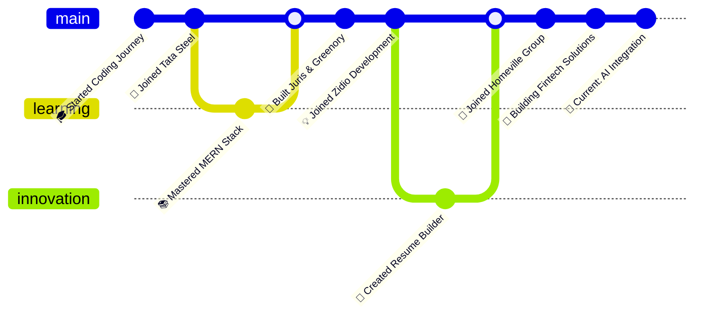

```ascii
███████╗██╗   ██╗███╗   ██╗██████╗  █████╗ ██████╗  █████╗ ███╗   ███╗    ██████╗  █████╗ ██╗
██╔════╝██║   ██║████╗  ██║██╔══██╗██╔══██╗██╔══██╗██╔══██╗████╗ ████║    ██╔══██╗██╔══██╗██║
███████╗██║   ██║██╔██╗ ██║██║  ██║███████║██████╔╝███████║██╔████╔██║    ██████╔╝███████║██║
╚════██║██║   ██║██║╚██╗██║██║  ██║██╔══██║██╔══██╗██╔══██║██║╚██╔╝██║    ██╔══██╗██╔══██║██║
███████║╚██████╔╝██║ ╚████║██████╔╝██║  ██║██║  ██║██║  ██║██║ ╚═╝ ██║    ██║  ██║██║  ██║██║
╚══════╝ ╚═════╝ ╚═╝  ╚═══╝╚═════╝ ╚═╝  ╚═╝╚═╝  ╚═╝╚═╝  ╚═╝╚═╝     ╚═╝    ╚═╝  ╚═╝╚═╝  ╚═╝╚═╝
```

<div align="center">

```javascript
console.log("Building the future, one commit at a time 🚀");
```

[](https://sundaramrai.vercel.app/)
[](https://linkedin.com/in/sundaramrai)
[](mailto:sundaramrai02@gmail.com)
[](https://leetcode.com/u/sundaramrai/)


</div>

---

## `$ whoami`

```python
class Developer:
    def __init__(self):
        self.name = "Sundaram Rai"
        self.role = "Full Stack Developer"
        self.location = "India 🇮🇳"
        self.company = "Homeville Group"
        self.languages = ["JavaScript", "TypeScript", "Python", "PHP"]
        self.current_focus = "AI integration with web platforms"
        self.interests = ["Web Dev", "SaaS", "Open Source", "EdTech", "Fintech"]
    
    def say_hi(self):
        print("Thanks for dropping by! Let's build something amazing together 🚀")
    
    def get_stack(self):
        return {
            "frontend": ["React", "Next.js", "Angular", "TypeScript"],
            "backend": ["Node.js", "Express", "Django", "Python"],
            "database": ["MongoDB", "MySQL", "Firebase"],
            "tools": ["Git", "Docker", "VS Code", "Postman"]
        }

me = Developer()
me.say_hi()
```

```bash
$ git clone https://github.com/future.git
$ cd innovative-projects
$ npm install collaboration
$ npm run build-together
```

---

## `$ cat experience.log`

```diff
+ [2025-01-XX → Present] Developer Intern @ Homeville Group
  ├─ Building fintech solutions with Angular & TypeScript
  ├─ Optimizing performance and enhancing UX
  └─ Cross-functional team collaboration

+ [2024-06-XX → 2024-09-XX] Web Developer Intern @ Zidio Development
  ├─ Developed Resume Builder & Job Portal (MERN Stack)
  ├─ Implemented real-time database integration
  └─ Optimized data handling and search algorithms

+ [2023-08-XX → 2024-01-XX] Software Developer Intern @ Tata Steel Limited
  ├─ Built production analytics app (React.js + Node.js)
  ├─ Automated data collection and visualization
  └─ Delivered real-time operational insights

# Career Progression: Loading... ████████████░░░░ 85%
```

---

## `$ ls -la skills/`

<div align="center">

```bash
drwxr-xr-x  frontend/
```


```bash
drwxr-xr-x  backend/
```


```bash
drwxr-xr-x  database_and_tools/
```


</div>

---

## `$ cat projects.json | jq`

```json
{
  "featured_projects": [
    {
      "name": "Juris",
      "type": "Legal Tech SaaS",
      "description": "Comprehensive legal document & case management platform",
      "stack": ["React", "Node.js", "Express", "MongoDB"],
      "features": [
        "Document organization & version control",
        "Case tracking & deadline management",
        "Secure authentication & RBAC",
        "Responsive cross-device design"
      ],
      "live_demo": "https://juris-legal.vercel.app",
      "repo": "https://github.com/sundaramrai/juris"
    },
    {
      "name": "Greenory",
      "type": "Sustainability Platform",
      "description": "Eco-friendly living platform with community engagement",
      "stack": ["Next.js", "TailwindCSS", "Firebase"],
      "features": [
        "Curated eco-friendly resources",
        "Community-driven discussions",
        "Personal sustainability tracking",
        "Modern accessible UI/UX"
      ],
      "live_demo": "https://greenory.vercel.app",
      "repo": "https://github.com/sundaramrai/greenory"
    },
    {
      "name": "LingoLeap",
      "type": "EdTech Platform",
      "description": "Gamified Hindi language learning for children",
      "stack": ["Next.js", "Node.js", "TailwindCSS", "MongoDB"],
      "features": [
        "Gamified learning modules",
        "Progress tracking & analytics",
        "Personalized learning paths",
        "Achievement & reward system"
      ],
      "live_demo": "https://lingoleap.vercel.app",
      "repo": "https://github.com/RayaanQ/Misarticulation-Project/tree/LingoLeap"
    }
  ],
  "total_commits": "Loading...",
  "coffee_consumed": "∞",
  "bugs_fixed": "Too many to count 🐛"
}
```

<div align="center">

### `> view_projects.sh`

[](https://juris-legal.vercel.app)
[](https://greenory.vercel.app)
[](https://lingoleap.vercel.app)

**[View Source Code](https://github.com/sundaramrai?tab=repositories)**

</div>

---

## `$ git log --graph --oneline --all`

<div align="center">



</div>

---

## `$ ./github-stats.sh --detailed`

<div align="center">


</div>

<div align="center">

### `$ trophy-case --display`


</div>

---

## `$ ./contribution-graph.py --year 2025`

<div align="center">


</div>

---

## `$ cat code_philosophy.txt`

```javascript
const codePhilosophy = {
  principles: [
    "Clean code is better than clever code",
    "Make it work, make it right, make it fast",
    "Code is read more often than it's written",
    "Always leave the codebase better than you found it"
  ],
  approach: {
    problem_solving: "Break it down, build it up",
    collaboration: "Communication > Code",
    learning: "Never stop exploring"
  },
  quote: "Code is poetry written in logic 💭"
};

// Current Mission: Design × Logic × UX = Impact ⚡
```

---

## `$ ping -c 5 sundaram.dev`

<div align="center">

```bash
PING sundaram.dev (127.0.0.1): 56 data bytes
64 bytes from 127.0.0.1: icmp_seq=0 ttl=64 time=0.042 ms
--- Available on multiple channels ---
```

### **Connect** `&&` **Collaborate**

```javascript
const contact = {
  email: "sundaramrai02@gmail.com",
  portfolio: "https://sundaramrai.vercel.app/",
  linkedin: "linkedin.com/in/sundaramrai",
  github: "github.com/sundaramrai",
  leetcode: "leetcode.com/u/sundaramrai"
};

// Always open to innovative projects and collaborations 🤝
// Let's build something extraordinary together! 🚀
```

[](mailto:sundaramrai02@gmail.com)
[](https://sundaramrai.vercel.app/)
[](https://linkedin.com/in/sundaramrai)

</div>

---

<div align="center">

```bash
$ fortune | cowsay
 _________________________________
< Thanks for visiting my profile! >
 ---------------------------------
        \   ^__^
         \  (oo)\_______
            (__)\       )\/\
                ||----w |
                ||     ||
```


[](https://github.com/sundaramrai?tab=followers)
[](https://github.com/sundaramrai?tab=repositories)

```diff
+ Star ⭐ my repositories if you find them interesting!
+ Fork 🍴 them to contribute
+ Follow 👥 for more amazing projects
```

### `while(alive) { eat(); sleep(); code(); repeat(); }`


</div>
